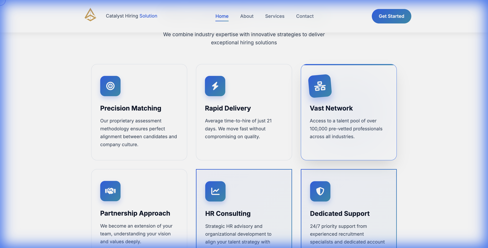
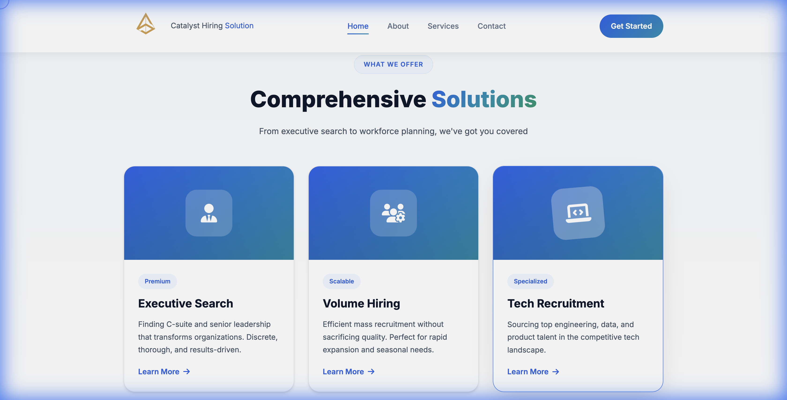
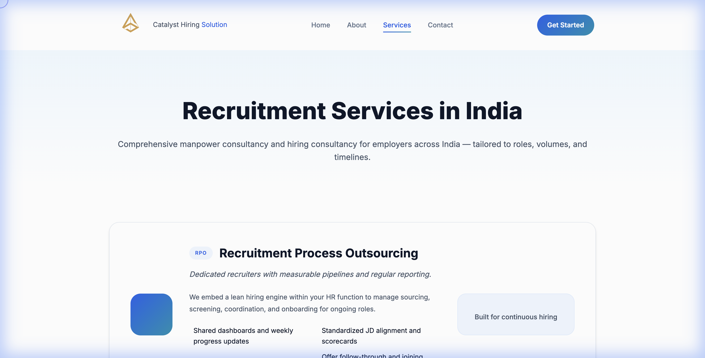
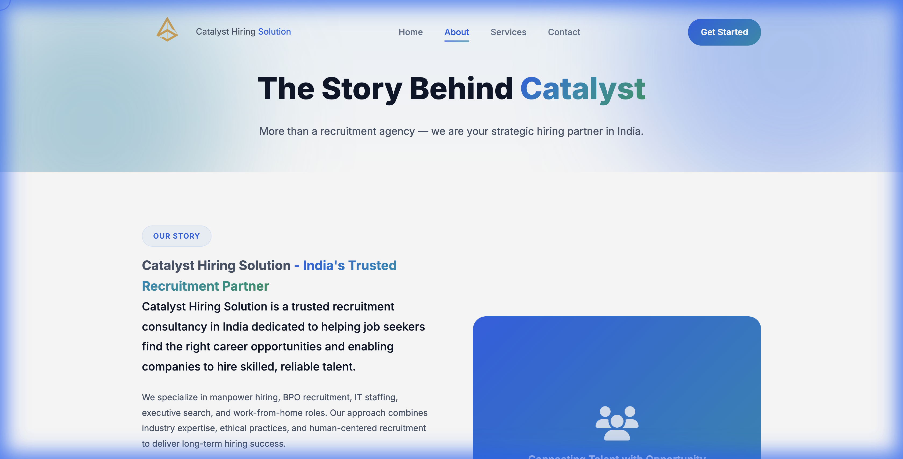
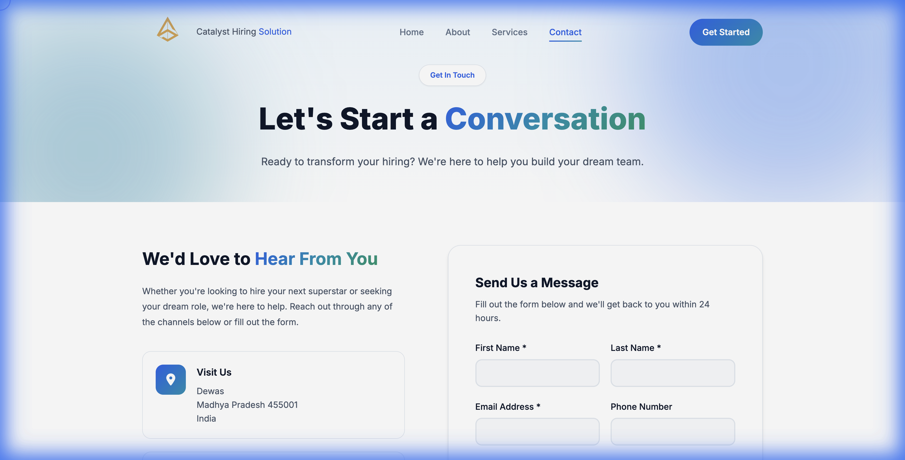

# Catalyst Hiring Solutions - Corporate Website

> [!CAUTION]
> **Copyright Notice**: This project and its design are proprietary and copyrighted. All rights reserved. This repository is for **portfolio showcase purposes only**. Unauthorized copying, modification, or use of this design is strictly prohibited.

## 🎯 Project Overview
A premium corporate website designed and developed for **Catalyst Hiring Solutions**, a leading recruitment agency. The website serves as a digital hub for connecting talent with opportunity, featuring a modern, clean interface that builds trust and authority.

The goal was to create a professional online presence that effectively communicates the agency's value proposition to both job seekers and employers.

## 🚀 Live Website
[https://www.catalysthiringsolutions.in](https://www.catalysthiringsolutions.in)

## 💻 Technology Stack
- **Frontend**: HTML5, CSS3, JavaScript
- **Design**: Responsive Web Design, Custom UI/UX
- **Animations**: Smooth scrolling, micro-interactions

## ✨ Key Features
- **Responsive Design**: Fully optimized for mobile, tablet, and desktop devices.
- **Modern UI/UX**: Clean typography, professional color palette, and intuitive navigation.
- **Service Showcase**: Dedicated sections for recruitment services for employers and job seekers.
- **Contact Integration**: Easy-to-use contact forms and location details.

## 📸 Design Showcase

### Homepage

### Features & Services

  
  

### Service Pages

### About & Contact

  
  

## 📧 Contact
For inquiries about this project or to discuss potential collaborations, please reach out via GitHub or my professional email.

---

**Note**: Source code is not available in this repository to protect client intellectual property. This repository serves as a design and development showcase.
