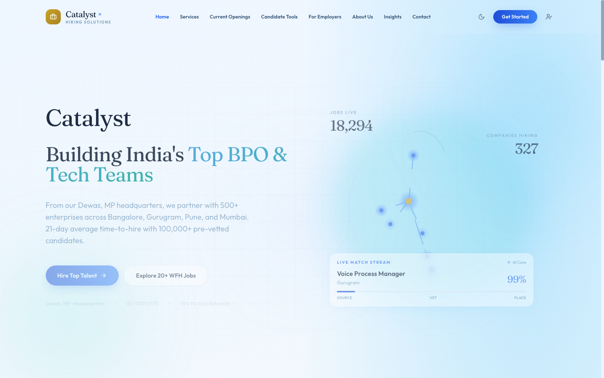
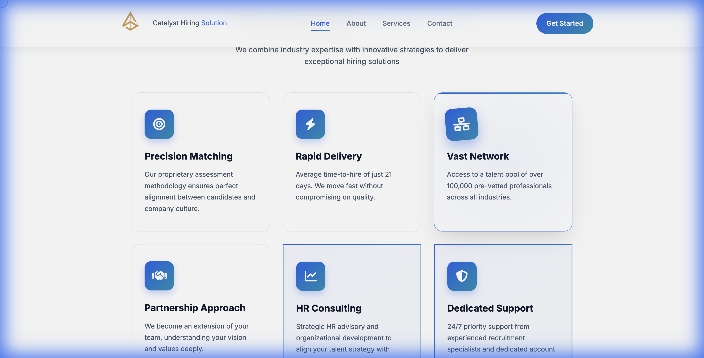
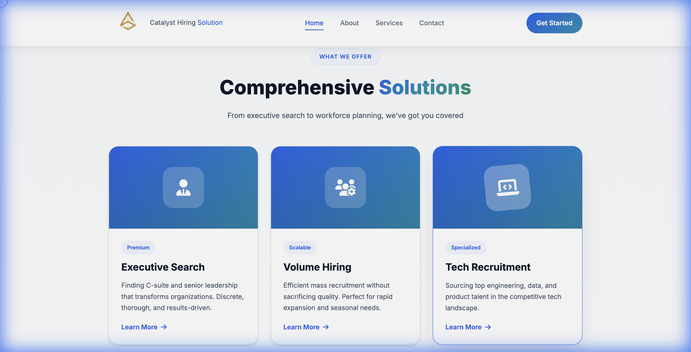
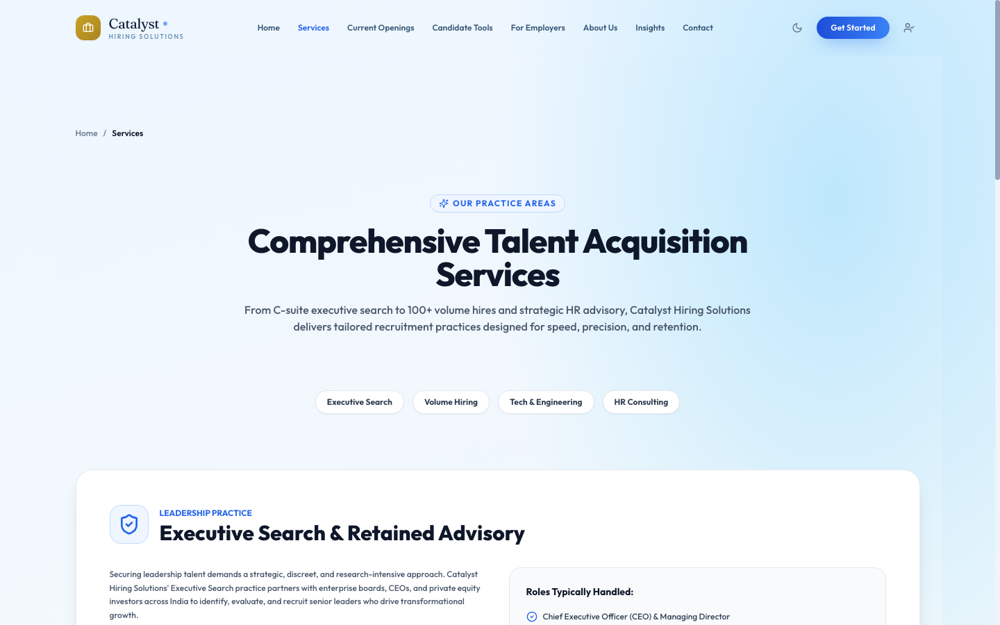
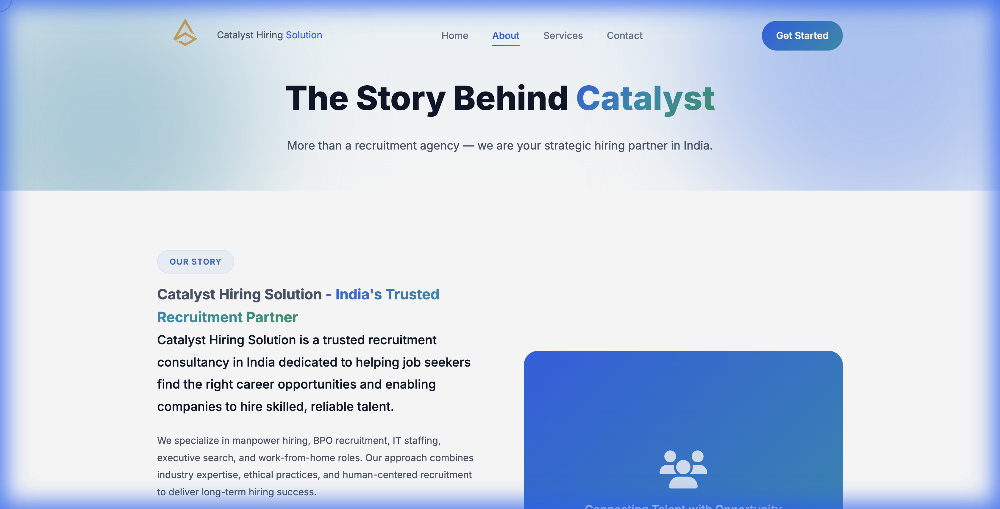
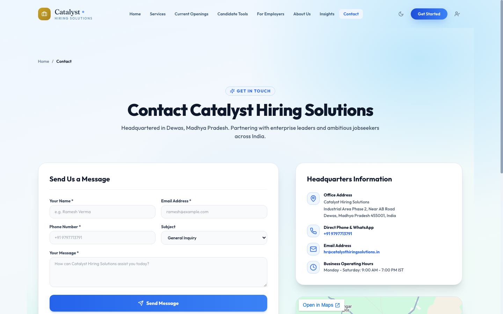

# 🌟 Catalyst Hiring Solutions — Next.js 14 Enterprise Talent Platform

<div align="center">


**An ultra-modern, high-performance recruitment & executive talent acquisition platform engineered for 500+ enterprise clients across India with 100/100 SEO, 53+ pre-rendered SSG pages, and interactive visual aesthetics.**

[🌐 Live Website](https://www.catalysthiringsolutions.in) • [💼 Career Openings](https://www.catalysthiringsolutions.in/careers) • [🏢 Employer Portal](https://www.catalysthiringsolutions.in/hire) • [🤖 ATS Resume Checker](https://www.catalysthiringsolutions.in/candidate)

</div>

---

> [!NOTE]
> **Portfolio & Design Showcase**: This repository is a dedicated public portfolio showcase presenting the architectural design, feature suite, and engineering achievements of **Catalyst Hiring Solutions**. Proprietary production source code, private database schemas, and API secrets are securely retained to protect client intellectual property.

---

## 🎯 Executive Overview

**Catalyst Hiring Solutions** is a modern recruitment and talent advisory platform engineered to connect enterprise employers with top-tier executive, technology, and volume workforce across India. Built from scratch with an emphasis on **high aesthetic design, sub-second performance, multi-channel lead acquisition, and enterprise-grade SEO (100/100)**.

---

## 💻 Technology Stack & Architecture

| Layer | Technologies Used | Description |
| :--- | :--- | :--- |
| **Frontend Framework** | **Next.js 14 (App Router)** | Server Components, Server-Side Rendering (SSR) & Static Site Generation (SSG) for 53+ pre-rendered pages. |
| **Languages** | **TypeScript & Modern JavaScript (ES2024)** | 100% type-safe application logic with strict interface contracts. |
| **Styling & UI** | **Tailwind CSS & Custom HSL Design Tokens** | Glassmorphism surfaces, responsive typography scales, and tailored dark-blue & gold palette. |
| **Motion & Visuals** | **Framer Motion & Hardware Acceleration** | Hardware-accelerated SVG talent network radar, micro-interactions, and smooth layout transitions. |
| **Database & Cloud** | **Supabase (PostgreSQL)** | Cloud-native relational database with Row-Level Security (RLS) for job applications, employer leads, and candidate records. |
| **Email Infrastructure** | **Resend API Engine** | Automated transactional alerts with responsive HTML notification templates. |
| **Icons & Media** | **Lucide React & Next.js Edge OG** | Dynamic Edge runtime Favicons (`/icon.png`), Apple Touch Icons (`/apple-icon.png`), and OpenGraph Social Banners (`/opengraph-image.png`). |

---

## ✨ Key Features Built

### 1. 💼 Advanced Careers & Work From Home Job Board
- **22+ Real-world Openings**: Full-time, Remote, and Work From Home customer support, BPO, technical support, and SaaS customer success roles.
- **Instant Search & Filter**: Real-time filtering by department category, work mode (WFH / Remote / Full-time), and experience level.
- **Triple-Channel Application Gateway**:
  - **1. Web Form Application**: Direct resume file upload (PDF/DOCX) + automated Resend email alert + database insertion.
  - **2. 1-Click WhatsApp Apply**: Instant WhatsApp direct chat launcher with pre-filled job title, location, and salary info.
  - **3. Direct Email Resume**: 1-click mailto launcher to official recruiter inbox (`hr@catalysthiringsolutions.in`).

### 2. 🤖 AI Candidate Hub & ATS Resume Vector Analyzer
- Interactive resume score checker parsing candidate skill density, ATS parser compatibility, and recruiter match percentage (0–100).
- Actionable feedback and optimization guidance for jobseekers.

### 3. 🏢 Employer Talent Portal & Interactive Hiring ROI Calculator
- Dedicated enterprise mandate intake portal for Executive Search, Volume Hiring Drives, and Tech GCC staffing.
- **Interactive ROI Calculator**: Real-time cost and hiring-time estimation slider demonstrating a 21-day turnaround vs the 60-day industry average.

### 4. 🔒 Protected Recruiter Admin Command Center
- Password-secured `/admin` dashboard.
- Live telemetry for incoming candidate applications, uploaded resumes, ATS scores, and employer leads.
- Full CRUD interface for creating, editing, and toggling active job postings.

### 5. 📍 Programmatic Local SEO City Hubs
- Dynamic landing pages for top Indian recruitment markets: **Bangalore, Delhi NCR & Gurugram, Pune, Mumbai, Hyderabad, Dewas & Indore**.
- City-specific candidate metrics, key industries, top in-demand roles, and localized job openings.

---

## 🎨 Interactive Visual Effects & Performance

- **Pan-India Talent Radar**: Interactive SVG talent hub network connecting Dewas HQ to Bangalore, Delhi, Pune, Mumbai, Hyderabad, and Chennai with animated pulse rings and live match stream feeds.
- **Hardware-Accelerated Ambient Aurora**: Lightweight CSS radial gradients running on GPU compositor layers (`transform: translate3d(0,0,0)`) for smooth 60–120 FPS performance on all devices.
- **Interactive Confetti & Delights**: Micro-animations and celebratory feedback upon form submission.

---

## 🔍 Enterprise 100/100 Technical SEO Suite

```
✅ Google Lighthouse SEO Score: 100 / 100
✅ 53 / 53 Pre-rendered Static HTML Pages (SSG)
✅ Google for Jobs Rich Results Verified
```

- **Schema.org Structured Data (JSON-LD)**:
  - `JobPosting` schema for automatic indexing in **Google for Jobs** cards.
  - `Organization` & `WebSite` schema with Google Sitelinks Searchbox (`SearchAction`).
  - `EmploymentAgency / LocalBusiness` with geo-coordinates and address.
  - `BreadcrumbList` & `BlogPosting / Article` schemas.
- **Dynamic Crawlability**:
  - Auto-generated XML Sitemap (`/sitemap.xml`) indexing all static, city, and career routes.
  - Optimized `robots.txt` crawler directives.
  - Live XML RSS Feed (`/feed.xml`) for instant search engine discovery.
- **Brand Assets & Mobile PWA**:
  - Dynamic Edge Favicon (`/icon.png`) & Apple Touch Icon (`/apple-icon.png`).
  - 1200x630px dynamic OpenGraph social preview banner (`/opengraph-image.png`).
  - Web App Manifest (`manifest.webmanifest`) for Google Mobile-First Indexing.

---

## 📸 Design Showcase

### Homepage Hero & Talent Radar


### Key Features & Client Proof
<div style="display: flex; gap: 10px;">
  
  
</div>

### Services & Practice Breakdown


### About Company & Contact Advisory
<div style="display: flex; gap: 10px;">
  
  
</div>

---

## 📧 Contact & Collaborations
For inquiries regarding this platform architecture or potential technical collaborations, connect via GitHub or official recruitment desk at **hr@catalysthiringsolutions.in**.

---

<div align="center">
Designed & Built with ❤️ by <a href="https://github.com/RayeesYousufGenAi">Rayees Yousuf</a> • Powered by Next.js 14
</div>
