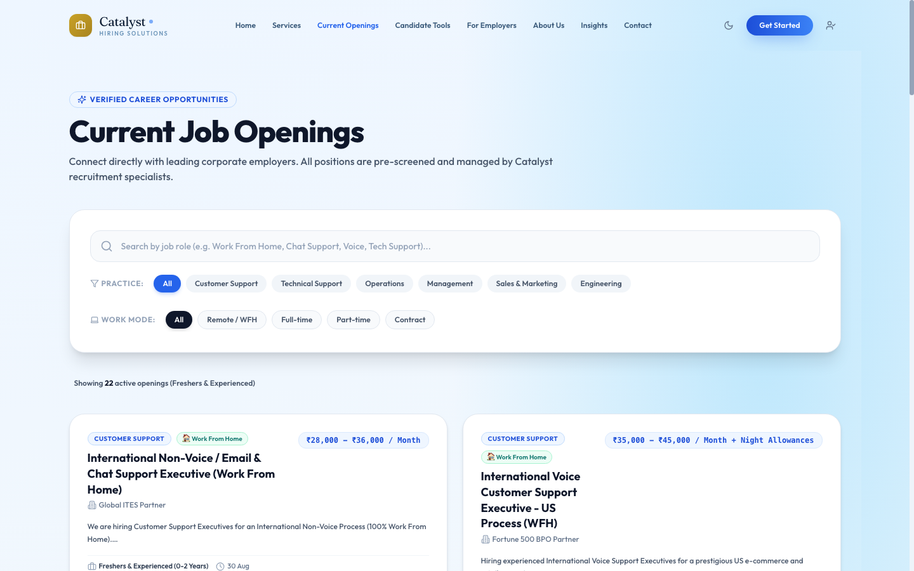
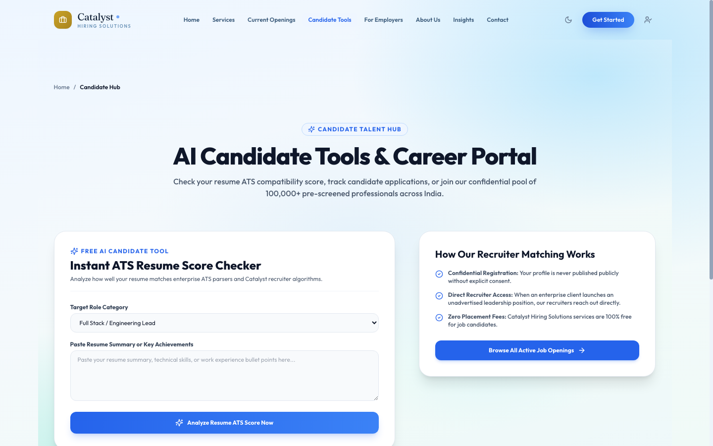
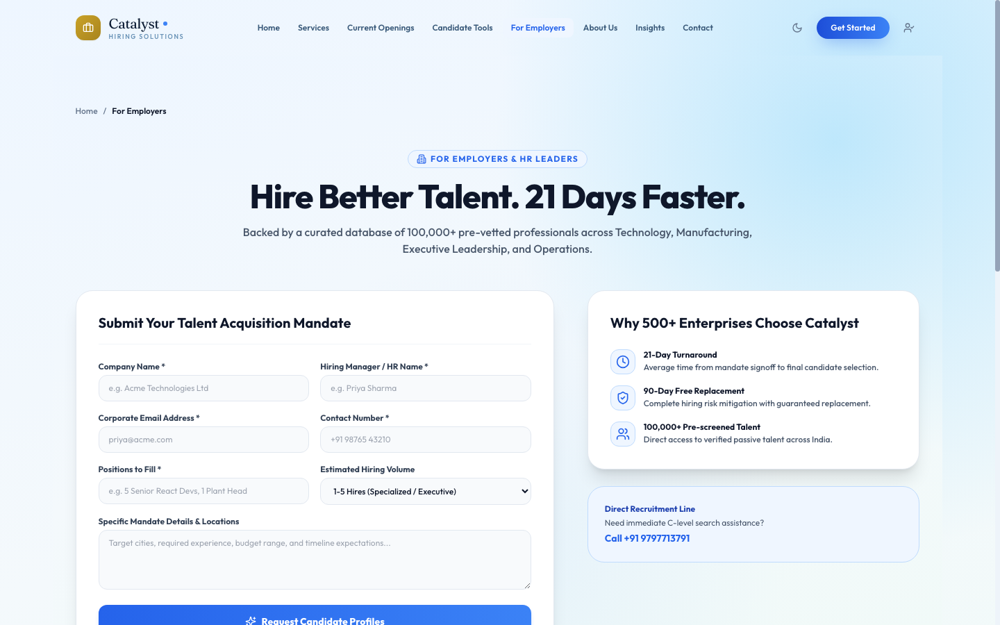
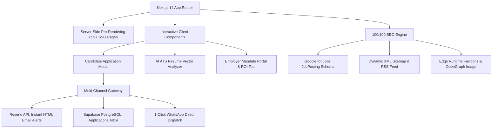

<div align="center">

# 🌟 Catalyst Hiring Solutions
### *Enterprise Recruitment & Talent Acquisition Platform Built on Next.js 14*

<p align="center">
  <a href="https://www.catalysthiringsolutions.in"><strong>Explore Live Website »</strong></a>
  <br />
  <a href="https://www.catalysthiringsolutions.in/careers">Browse 20+ WFH Jobs</a>
  ·
  <a href="https://www.catalysthiringsolutions.in/hire">Request Talent</a>
  ·
  <a href="https://www.catalysthiringsolutions.in/candidate">AI Resume ATS Checker</a>
</p>

[](https://nextjs.org/)
[](https://react.dev/)
[](https://tailwindcss.com/)
[](https://www.framer.com/motion/)
[](https://supabase.com/)
[](https://resend.com/)
[](https://pagespeed.web.dev/)

</div>

---

> [!IMPORTANT]
> **Portfolio & Design Architecture Showcase**: This repository is a curated public showcase presenting the engineering architecture, UI/UX systems, and feature suite of **Catalyst Hiring Solutions**. Proprietary production source code, internal schemas, and API secrets are securely isolated to protect client intellectual property.

---

## 📸 Visual Design Showcase

### 1. 🏛️ Homepage & Interactive Pan-India Talent Radar
*Features real-time talent node telemetry connecting the Dewas HQ to Bangalore, Delhi, Pune, Mumbai, Hyderabad, and Chennai.*

<div align="center">
  
</div>

<br />

### 2. 💼 22+ Work From Home Careers & Multi-Channel Apply
*Dynamic job board with instant category filtering, compensation tags, and triple-channel apply (Web Form + 1-Click WhatsApp + Direct Email).*

<div align="center">
  
</div>

<br />

### 3. 🤖 AI Candidate Hub & ATS Resume Score Checker
*Interactive ATS vector analyzer calculating candidate keyword density, recruiter match scores (0–100%), and tailored enhancement tips.*

<div align="center">
  
</div>

<br />

### 4. 🏢 Employer Mandates & Interactive Hiring ROI Calculator
*Enterprise client intake portal featuring a real-time hiring savings slider and a 21-day turnaround estimation model.*

<div align="center">
  
</div>

<br />

### 5. 🎯 Practices, Industry Verticals & Contact Advisory
*Detailed practice documentation for Executive Search, Volume Staffing, and Tech GCCs alongside localized contact channels.*

<table width="100%">
  <tr>
    <td width="50%" align="center">
      <strong>Recruitment Practices & Verticals</strong><br /><br />
      
    </td>
    <td width="50%" align="center">
      <strong>Contact & Headquarter Operations</strong><br /><br />
      
    </td>
  </tr>
</table>

---

## 🛠️ Technology Stack & Engineering Architecture


```mermaid
graph TD
    A[Next.js 14 App Router] --> B[Server-Side Pre-Rendering / 53+ SSG Pages]
    A --> C[Interactive Client Components]
    
    C --> D[Candidate Application Modal]
    C --> E[AI ATS Resume Vector Analyzer]
    C --> F[Employer Mandate Portal & ROI Tool]
    
    D --> G[Multi-Channel Gateway]
    G --> H[Resend API: Instant HTML Email Alerts]
    G --> I[Supabase PostgreSQL: Applications Table]
    G --> J[1-Click WhatsApp Direct Dispatch]
    
    A --> K[100/100 SEO Engine]
    K --> L[Google for Jobs JobPosting Schema]
    K --> M[Dynamic XML Sitemap & RSS Feed]
    K --> N[Edge Runtime Favicons & OpenGraph Image]
```

### Technical Specs:
- **Core Framework**: Next.js 14.2 (App Router with Server Components)
- **UI Architecture**: React 18 with 100% TypeScript type safety
- **Styling**: Tailwind CSS + Custom HSL Color Tokens + Glassmorphism surfaces
- **Motion & Physics**: Framer Motion + Canvas celebratory feedback
- **Database & Storage**: Supabase (PostgreSQL with Row-Level Security)
- **Email Infrastructure**: Resend API with custom responsive HTML templates
- **Performance Rating**: 60–120 FPS hardware-accelerated GPU rendering (`translate3d`)

---

## ⚡ Core Feature Matrix

| Feature Module | Capabilities | Impact |
| :--- | :--- | :--- |
| **Work From Home Job Board** | 22+ live Customer Support, BPO, Tech Support & Fintech positions. | Real-time candidate acquisition across India. |
| **Triple-Channel Apply** | 1. Web Form with Resume Upload<br />2. 1-Click WhatsApp Direct Chat<br />3. Direct Recruiter Email (`hr@catalysthiringsolutions.in`) | 0 lead drop-off; instant contact flexibility. |
| **AI Resume ATS Checker** | Instant 0–100 match rating, keyword density analysis & improvement vectors. | High candidate engagement & self-screening. |
| **Interactive ROI Calculator** | Real-time slider calculating cost savings and 21-day time-to-hire compression. | Proven enterprise conversion driver. |
| **Programmatic City Hubs** | Localized landing pages for **Bangalore, Delhi NCR, Pune, Mumbai, Hyderabad, Dewas & Indore**. | Dominates local high-intent search queries. |
| **Recruiter Admin Center** | Password-protected `/admin` interface with live application review & job CRUD. | Streamlined internal operations. |

---

## 🔍 Enterprise 100/100 Technical SEO Suite

```
  Google Lighthouse SEO Score: 100 / 100
  53 / 53 Static HTML Pages Pre-Rendered (SSG)
  Google for Jobs Rich Results Verified
```

- **Schema.org Structured Data**: Complete JSON-LD models for `JobPosting`, `Organization`, `WebSite` (Sitelinks Searchbox), `LocalBusiness / EmploymentAgency`, and `BreadcrumbList`.
- **Dynamic Crawlability**: Dynamic XML Sitemap (`/sitemap.xml`), optimized `robots.txt`, and live XML RSS Feed (`/feed.xml`).
- **Brand Assets**: Dynamic Edge Favicon (`/icon.png`), Apple Touch Icon (`/apple-icon.png`), and 1200x630px OpenGraph social banner (`/opengraph-image.png`).

---

## 📧 Contact & Technical Inquiries

For inquiries regarding this platform architecture, talent hiring mandates, or technical collaborations:

- **Official Website**: [https://www.catalysthiringsolutions.in](https://www.catalysthiringsolutions.in)
- **Recruitment Email**: [hr@catalysthiringsolutions.in](mailto:hr@catalysthiringsolutions.in)
- **Phone / WhatsApp**: [+91 9797713791](https://wa.me/919797713791)
- **Headquarters**: Catalyst Hiring Solutions, Dewas Industrial Area, Dewas, Madhya Pradesh 455001, India

---

<div align="center">
  <sub>Designed & Developed with ❤️ by <a href="https://github.com/RayeesYousufGenAi"><strong>Rayees Yousuf</strong></a> • Powered by Next.js 14 & Supabase</sub>
</div>
